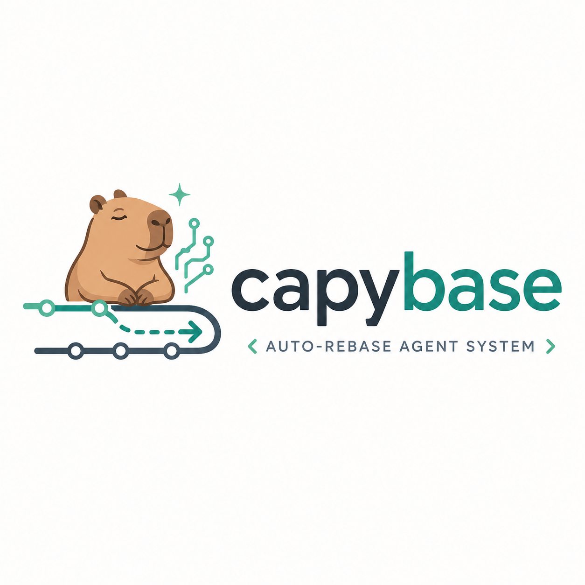

<p align="center"></p>

# capybase

A rebase-conflict resolution agent for local OpenAI-compatible LLM endpoints
(llama-server, LM Studio, etc.). It runs the entire rebase — preflight, backup
branch, resolve → test → continue — and aborts on escalation so your branch
returns to its original HEAD.

Apache-2.0.

## Setup

### 1. Configure the endpoint

Runtime config lives in `capybase.toml` (a template ships in this repo; the
canonical location is `~/.config/capybase/`). Set at minimum:

```toml
[model]
provider = "openai_compatible"
base_url = "http://localhost:8080/v1"
api_key  = "sk-local"
model    = "chat"          # the id /v1/models reports
```

### 2. Calibrate for your model

`max_tokens`, JSON-mode, context window, generation timeout, sample count, and
the prompt-rendering layout all depend on the model behind the endpoint.
Calibrate probes the live model and empirically discovers the best settings:

```bash
capybase calibrate              # probe + multi-fidelity epoch sweep → tuned profile
capybase calibrate --dry-run    # capabilities-only check, no profile written
capybase calibrate --list-tasks # show available task-family corpora
```

**How it works.** The calibration runs a multi-fidelity epoch search:

1. **Capability probe** — measures JSON success rate, thinking-chain length,
   instruction-following, and corpus correctness on a stratified spot-check.
   Models that are near-perfect on *both* parseability and real-merge
   correctness trigger an early-exit (the DOE is skipped, defaults locked in).
2. **Epoch 1 (screening)** — a Resolution-IV fractional-factorial design (16
   runs) samples all factor variations on a small corpus prefix. Main effects
   + t-stats rank which factors genuinely drive performance.
3. **Epoch 2 (refinement)** — a full factorial on the top-3 factors + the
   best Epoch-1 survivors, on a larger corpus prefix. Discovers configurations
   the screening couldn't represent.
4. **Epoch 3 (tie-breaker)** — the top-2 finalists on the full corpus. Runs
   only when Epoch 2 couldn't separate them.

**Anytime halt.** Each epoch is a valid stopping point. Ctrl-C at any time
after the first completed evaluation returns the best-so-far configuration
and writes the profile — no lost work.

The 13 calibration factors span prompt-rendering axes (`output_layout`,
`instruction_position`, `history_framing`, `example_limit`, `rule_emphasis`,
`conflict_summary_mode`, `side_ordering`, `parse_repair_mode`, `retry_schedule`)
and mechanism axes (`samples`, `diverse_sampling`, `prompt_variants`,
`enable_self_consistency`). The capability signals drive which subset is
screened; `--enable-factor` forces specific factors for manual exploration.

The profile is written to `.rebase-agent/memory/model_profile.json` and applied
on every run when the model name matches. For noise-robust calibration on
thinking models, use `--calibrate-reps 3` (majority vote across replicated
evals). See `docs/PROMPT_FACTORS.md` for the factor reference.

### 3. (Optional) Calibrate embeddings RAG

If your endpoint serves `/v1/embeddings`, `capybase calibrate` detects it and
enables semantic retrieval. `capybase calibrate-embeddings` fits the similarity
floor for your model.

## Use

### Safety-first rebase

```bash
capybase check                       # git + LLM + tools ready? (no mutation)
capybase rebase --dry-run <target>   # rehearse in a throwaway worktree
capybase rebase <target>             # real rebase, owns start → finish
capybase status                      # read-only: latest session + backups
```

Before each rebase, capybase records a backup branch
`capybase/backup/<branch>@<ts>` at the pre-rebase HEAD and aborts on
escalation so the repo returns to its original HEAD. `--dry-run` runs the full
pipeline (real LLM calls, genuine conflicts) in a throwaway worktree without
moving your branch.

When auto-resolution fails and a TTY is present, capybase drops into an
interactive menu (paste a resolution, edit the file, skip, or abort).
`--no-interactive` suppresses this for CI.

### Manual stepping

```bash
capybase inspect   # detect conflicts, write review bundle (no mutation)
capybase manual    # interactive: paste resolutions, validate, stage
capybase run       # full auto: resolve → test → continue
```

Every session writes a journal under `.rebase-agent/sessions/`. On escalation,
`final/review-bundle.md` explains why it stopped and how to resume.

> **`.rebase-agent/` is sensitive** — it stores prompts, conflict snippets,
> candidate resolutions, and file snapshots. It is in `.gitignore`; when
> running against other repos, confirm they ignore it too.

## Resolution layers

A conflict is resolved through a layered pipeline (cheapest/safest first).
Each non-LLM layer declines to the next on any doubt; every accepted result
runs the full validation pipeline before it's applied.

1. **Structural resolver** (default on) — model-free rules for identical sides,
   one-sided changes, disjoint line edits, and clean deletions. Zero LLM calls.
2. **Combination search** (default on) — enumerates order-preserving
   interleavings of the two sides for the best combination.
3. **Block-capture** (default on) — for large modify/delete conflicts: makes a
   keep/delete/escalate decision and splices the chosen side verbatim.
4. **LLM resolution** — the model resolves conflicts the pre-LLM layers
   declined, grounded in base + both sides + AST context + RAG few-shot.
5. **CEGIS repair** — failures feed back as counterexamples; the model
   re-resolves with the broken output + the specific failure, bounded by retry
   policy.

### Validation

Every accepted resolution passes through:

- **No conflict markers** left in the splice.
- **Exact splice scope** — the merge didn't bleed outside the conflict region.
- **Compile floor** — the fully-spliced file is compile-checked after every
  resolution (Python: `py_compile`; Rust: `cargo check` or `rustc`).
- **Syntax / AST preservation** — the merge didn't drop unchanged structure.
- **Both-sides-represented** — a side's additions weren't silently dropped.
- **Verifier-model critic** (default on) — an LLM judge checks the resolution
  preserves both sides' semantic intent. Opt out with
  `validation.enable_verifier_model = false`.
- **Silent-resurrection detection** (default on) — after a clean rebase,
  compares the result against content the target branch deliberately deleted
  and flags any that came back.

### Language support

**Python and Rust** are first-class — both get the layered pipeline and
compile-checked verification. With the optional `structural` extra,
tree-sitter resolves the enclosing AST node (`def`/`fn`/`impl`/`struct`) for
entity-level merge context. LSP diagnostics (`rust-analyzer`, `pyright`) are
available as a deeper check via `validation.enable_lsp_diagnostics`.

### Reasoning models

capybase is built for reasoning models (VibeThinker, DeepSeek-R1 style) that
emit long thinking chains. Three knobs matter:

- **`max_tokens`** — large enough for the reasoning chain + the JSON answer.
  Too low → `finish_reason=length` → empty resolution. Calibrate discovers this.
- **`generation_timeout_seconds`** — hard wall-clock cap on one attempt.
- **`request_timeout_seconds`** — per-read socket timeout.

## Status

Python and Rust are fully supported end to end. The verifier-model critic is
wired and default-on. RAG experience replay (`[memory]`) and self-consistency
are wired but off by default. Structural context requires the optional
`structural` extra. Mutation testing is a stub.
