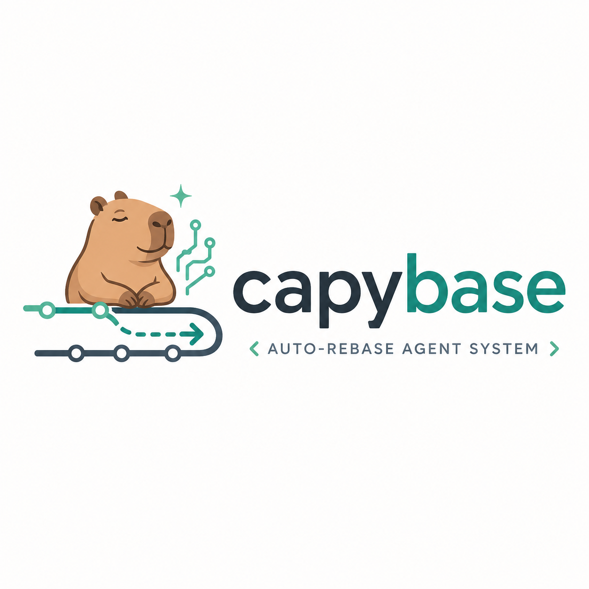

<p align="center"></p>

# capybase

A rebase-conflict resolution agent for local OpenAI-compatible LLM endpoints
(llama-server, LM Studio, etc.). It runs the entire rebase — preflight, backup
branch, resolve → test → continue — and aborts on escalation so your branch
returns to its original HEAD. Supports **Python, Rust, and C/C++** with
language-appropriate compile verification.

Apache-2.0.

## Setup

### 1. Install

```bash
git clone <repo> && cd capybase
python -m venv .venv && . .venv/bin/activate
pip install -e ".[dev]"          # installs capybase + test/embedding deps
```

The diff core (`capybase._cdiff`) is a C extension built automatically during
install. It accelerates the histogram diff and character-level LCS ratio used
by the structural resolver and SBCR fitness. If the build succeeds, the `.so`
lands next to the package; if a C compiler is unavailable, capybase falls back
to a pure-Python implementation (correct, slower on large conflicts). After
pulling changes to `_cdiff.c`, rebuild:

```bash
pip install -e . --force-reinstall --no-build-isolation
```

### 2. Configure the endpoint

Runtime config lives in `capybase.toml` (a template ships in this repo; the
canonical location is `~/.config/capybase/`). Set at minimum:

```toml
[model]
provider = "openai_compatible"
base_url = "http://localhost:8080/v1"
api_key  = "sk-local"
model    = "chat"          # the id /v1/models reports
```

### 3. Calibrate for your model

`max_tokens`, JSON-mode, context window, generation timeout, sample count, and
the prompt-rendering layout all depend on the model behind the endpoint.
Calibrate probes the live model and empirically discovers the best settings:

```bash
capybase calibrate              # probe + multi-fidelity epoch sweep → tuned profile
capybase calibrate --dry-run    # capabilities-only check, no profile written
capybase calibrate --list-tasks # show available task-family corpora
```

**How it works.** The calibration runs a multi-fidelity epoch search:

1. **Capability probe** — measures JSON success rate, thinking-chain length,
   instruction-following, and corpus correctness on a stratified spot-check.
   Models that are near-perfect on *both* parseability and real-merge
   correctness trigger an early-exit (the DOE is skipped, defaults locked in).
2. **Epoch 1 (screening)** — a Resolution-IV fractional-factorial design (16
   runs) samples all factor variations on a small corpus prefix. Main effects
   + t-stats rank which factors genuinely drive performance.
3. **Epoch 2 (refinement)** — a full factorial on the top-3 factors + the
   best Epoch-1 survivors, on a larger corpus prefix. Discovers configurations
   the screening couldn't represent.
4. **Epoch 3 (tie-breaker)** — the top-2 finalists on the full corpus. Runs
   only when Epoch 2 couldn't separate them.

**Anytime halt.** Each epoch is a valid stopping point. Ctrl-C at any time
after the first completed evaluation returns the best-so-far configuration
and writes the profile — no lost work.

The 13 calibration factors span prompt-rendering axes (`output_layout`,
`instruction_position`, `history_framing`, `example_limit`, `rule_emphasis`,
`conflict_summary_mode`, `side_ordering`, `parse_repair_mode`, `retry_schedule`)
and mechanism axes (`samples`, `diverse_sampling`, `prompt_variants`,
`enable_self_consistency`). The capability signals drive which subset is
screened; `--enable-factor` forces specific factors for manual exploration.

The profile is written to `~/.config/capybase/model_profile.json` (the shared
config dir, so it's available across all repos — the model doesn't vary by
directory) and applied on every run when the model name matches. For
noise-robust calibration on thinking models, use `--calibrate-reps 3` (majority
vote across replicated evals). See `docs/PROMPT_FACTORS.md` for the factor
reference.

### 4. (Optional) Calibrate embeddings RAG

If your endpoint serves `/v1/embeddings`, `capybase calibrate` detects it and
enables semantic retrieval. `capybase calibrate-embeddings` fits the similarity
floor for your model.

### 5. Provider configs for live runs (canonical endpoint mechanism)

No host, IP, or machine name is tracked in this repository. Live runners
(the `scripts/live_eval*.py` harnesses, `scripts/run-live-test.sh`) resolve
their endpoint exclusively through a **provider config** — a small JSON under
`~/.config/capybase/providers/` (outside any repo) that bundles the host+model
pair for the LLM, optionally a SEPARATE host+model for embeddings, and the
REQUIRED calibration profile:

```json
{
  "profile": "e2b",
  "llm":       { "base_url": "http://your-server:8086/v1", "model": "chat" },
  "embeddings": { "base_url": "http://your-server:8085/v1", "model": "embed" }
}
```

```bash
capybase provider list                    # what's configured
.venv/bin/python scripts/live_eval_realworld.py --provider <name> ...
CB_PROVIDER=<name> ./scripts/run-live-test.sh
```

Precedence per field: CLI flag → `CAPYBASE_*` env var → provider file.
Profiles carry NO host information (one calibration can be reused against a
different host or model), running without a calibration profile is a hard
error, and nothing auto-creates or silently substitutes one. Full reference
— schema, refusal contract, reuse semantics, rerun recipes:
**[docs/PROVIDER_CONFIG.md](docs/PROVIDER_CONFIG.md)**.

**Repo hygiene hook.** `hooks/pre-commit` blocks commits that would introduce
IPv4 literals (non-loopback), `*.local` mDNS hostnames, or machine names into
tracked files. Enable it once per clone:

```bash
git config core.hooksPath hooks
```

## Use

### Safety-first rebase

```bash
capybase check                       # git + LLM + tools ready? (no mutation)
capybase rebase --dry-run <target>   # rehearse in a throwaway worktree
capybase rebase <target>             # real rebase, owns start → finish
capybase status                      # read-only: latest session + backups
```

Before each rebase, capybase records a backup branch
`capybase/backup/<branch>@<ts>` at the pre-rebase HEAD and aborts on
escalation so the repo returns to its original HEAD. `--dry-run` runs the full
pipeline (real LLM calls, genuine conflicts) in a throwaway worktree without
moving your branch.

When auto-resolution fails and a TTY is present, capybase drops into an
interactive menu (paste a resolution, edit the file, skip, or abort).
`--no-interactive` suppresses this for CI.

### Manual stepping

```bash
capybase inspect   # detect conflicts, write review bundle (no mutation)
capybase manual    # interactive: paste resolutions, validate, stage
capybase run       # full auto: resolve → test → continue
```

Every session writes a journal under `.rebase-agent/sessions/`. On escalation,
`final/review-bundle.md` explains why it stopped and how to resume.

> **`.rebase-agent/` is sensitive** — it stores prompts, conflict snippets,
> candidate resolutions, and file snapshots. It is in `.gitignore`; when
> running against other repos, confirm they ignore it too.

## Resolution layers

A conflict is resolved through a layered pipeline (cheapest/safest first).
Each non-LLM layer declines to the next on any doubt; every accepted result
runs the full validation pipeline before it's applied.

1. **Structural resolver** (default on) — model-free rules for identical sides,
   one-sided changes, disjoint line edits, clean deletions, collection unions
   (list, dict, brace, insertion), C preprocessor directive dedup, token-level
   disjoint edits, entity-disjoint merges, refactoring-aware composition, and
   additive line-union for non-code files (markdown/prose: both sides added
   content — CHANGELOG-class merges resolve deterministically without a
   model call). Zero LLM calls.
2. **Source-derived candidate portfolio** (default on) — before invoking the
   model, five deterministic candidates are assembled from the exact source
   lines (current-only, replayed-only, both orders, shared+distinct) and
   validated through the full pipeline. When one passes, the conflict resolves
   with zero model calls.
3. **Whole-file fast path** (default on) — when the full-file context says one
   side rewrote the file wholesale (churn ratio ≥ 0.90 with dominant churn),
   that side's pristine merge-index stage file is taken directly. Files with
   few conflict units require an LLM subsumption adjudication first (the
   loser may carry features worth weaving); a build fail-fast declines the
   swap when the winner fails the per-file build for merge-relevant reasons.
   A wholesale winner floor additionally guarantees the final resolution
   never drops the dominant rewrite, whichever path resolved the file. A
   mid-band variant (churn ratio 0.55–0.90 with ≥ 2.5× dominance) fires the
   same swap only when the adjudication confirms the winner subsumes the
   loser.
4. **Combination search** (default on) — enumerates order-preserving
   interleavings of the two sides for the best combination.
5. **Block-capture** (default on) — for large modify/delete conflicts: makes a
   keep/delete/escalate decision and splices the chosen side verbatim.
6. **LLM resolution** — the model resolves conflicts the pre-LLM layers
   declined, grounded in base + both sides + structural context + RAG few-shot.
   For oversized files, a lightweight file skeleton (extracted entity names)
   gives the model global awareness the windowed conflict region can't provide.
   An empty first response fast-fails to verified single-side candidates
   instead of burning retries.
7. **CEGIS repair** — failures feed back as counterexamples; the model
   re-resolves with the broken output + the specific failure, bounded by retry
   policy. Failed-patch memory carries summaries of prior attempts so the
   model doesn't repeat the same fix.
8. **Deterministic repair beam** — seven model-free repair mechanisms run
   before re-invoking the LLM: gcc-diagnostic-driven repair (missing `;`,
   missing `}`, stray characters), side-consistency restore, brace/semicolon
   consensus, and others. For C/C++, the compiler's own diagnostics drive the
   repair category.

### Validation

Every accepted resolution passes through:

- **No conflict markers** left in the splice.
- **Exact splice scope** — the merge didn't bleed outside the conflict region.
- **Compile floor** — the fully-spliced file is compile-checked after every
  resolution. Python: `py_compile`. Rust: `cargo check` or `rustc`. C/C++:
  per-unit `gcc`/`g++ -fsyntax-only` plus an optional whole-tree build
  (`make`/`cmake`) when configured — the authoritative oracle that resolves
  sibling headers standalone `gcc` can't. Compiler gates compare errors
  against a pre-conflict baseline (a merge fails only on errors it
  introduces) and abstain when the baseline check cannot run — an
  undecidable delta never fails a merge. Non-code files (markdown,
  lockfiles, prose) are exempt from the structural compile gates; they are
  judged by marker-free-ness and content checks.
- **Syntax / AST preservation** — the merge didn't drop unchanged structure.
- **Both-sides-represented** — a side's additions weren't silently dropped.
- **Verifier-model critic** (default on) — an LLM judge checks the resolution
  preserves both sides' semantic intent. Opt out with
  `validation.enable_verifier_model = false`.
- **Silent-resurrection detection** (default on) — after a clean rebase,
  compares the result against content the target branch deliberately deleted
  and flags any that came back.

### Language support

**Python, Rust, and C/C++** are first-class — all get the layered pipeline,
compile-checked verification, and the deterministic repair beam. A
grammar-free abstract parser (no tree-sitter dependency) resolves the
enclosing AST node (`def`/`fn`/`impl`/`struct`) for entity-level merge context
across ~13 languages. For C/C++, a lightweight skeleton extractor
(`adapters/c_skeleton.py`) recovers top-level entity names (includes, macros,
typedefs, structs, function signatures, globals) via a depth-tracking token
scanner — no full parser — and feeds them into oversized-file prompts so the
model has global entity awareness. LSP diagnostics (`rust-analyzer`,
`pyright`) are available as a deeper check via
`validation.enable_lsp_diagnostics`.

C/C++ whole-tree builds are non-uniform (no single `cargo check` equivalent),
so the build command is user-supplied per repo via `[tests] pre_continue`
(e.g. `make -j4`, `cmake --build build`, `./configure && make`). When the
build command can't complete (missing autotools macros, no compiler), the gate
falls back to per-unit `gcc -fsyntax-only` and never falsely rejects a correct
merge on an infrastructure failure.

### Reasoning models

capybase is built for reasoning models (VibeThinker, DeepSeek-R1 style) that
emit long thinking chains. Three knobs matter:

- **`max_tokens`** — large enough for the reasoning chain + the JSON answer.
  Too low → `finish_reason=length` → empty resolution. Calibrate discovers this.
- **`generation_timeout_seconds`** — hard wall-clock cap on one attempt.
- **`request_timeout_seconds`** — per-read socket timeout.

## Status

Python, Rust, and C/C++ are supported end to end. The deterministic layers
(structural rules, source-derived candidate portfolio, SBCR combination
search, whole-file fast path, wholesale winner floor, refactoring-aware
merge, gcc-diagnostic repair) run model-free before the LLM. The
verifier-model critic is wired and default-on. RAG experience replay
(`[memory]`) and self-consistency are wired but off by default. Mutation
testing is a stub.

### Results

The **661-case corpus of non-git-resolvable conflicts** (cases where
git's own three-way merge leaves markers — anything git resolves
cleanly is not a resolution problem) runs as a sharded harvest, one
language at a time, fixes landing between rounds. Current state —
all cases on the uniform commit `e7e7eb7`; Δ is versus the prior
full round.

| lang | cases | PASS | WORKING | era-dead | PASS % | adj % | P+W adj % | Δ adj |
|------|-------|------|---------|----------|--------|-----------|-----------|-------|
| python | 109 | 97 | 4 | 0 | 89.0% | 89.0% | 92.7% | −0.9pp |
| c | 204 | 88 | 1 | 97 | 43.1% | 82.2% | 83.2% | +3.9pp |
| rust | 194 | 157 | 0 | 24 | 80.9% | 92.4% | 92.4% | +1.2pp |
| cpp | 154 | 102 | 1 | 45 | 66.2% | 93.6% | 94.5% | +3.7pp |
| **total** | **661** | **444** | **6** | **166** | **67.2%** | **89.7%** | **90.9%** | **+1.8pp** |

**PASS** = marker-free, passes the compile/structural gate, and matches
the human resolution at token similarity ≥ 0.90, replayed live against
one local endpoint (provider configs only — hosts are never tracked).
**adj %** = PASS / (cases − era-dead):
era-dead cases are un-passable by construction (both sides and the
human oracle fail the current toolchain identically — environmental,
not resolver failures).
Non-PASS cases rerun up to 3 times, majority verdict. **P+W adj %**
adds WORKING verdicts — compiles, marker-free, both sides preserved,
diverged from the human resolution below the PASS bar — the honest
graded-success rate. Every number
recomputes from the per-case extracts committed under `docs/results/`
(current round: `s22r2/`, incl. its `meta.json` with the pinned
commit, commands, and flip-audit recipe).

### Corpus

661 non-git-resolvable rebase conflicts mined from upstream histories
(677 candidates; 16 git resolves cleanly on replay and are excluded) —
each case carries both sides, the merge base, and the actual human
resolution as the oracle: Python (flask, zenodo, requests; 109),
C (redis, sqlite, json-c; 204), Rust (tokio, axum, sea-orm, clap,
serde; 194), C/C++ (protobuf, clickhouse, nlohmann-json, fmt; 154). Earlier per-language
censuses (sprints 17–20) and their methodology notes live in
`docs/eval-results-tracker.md` and the sprint results docs.
