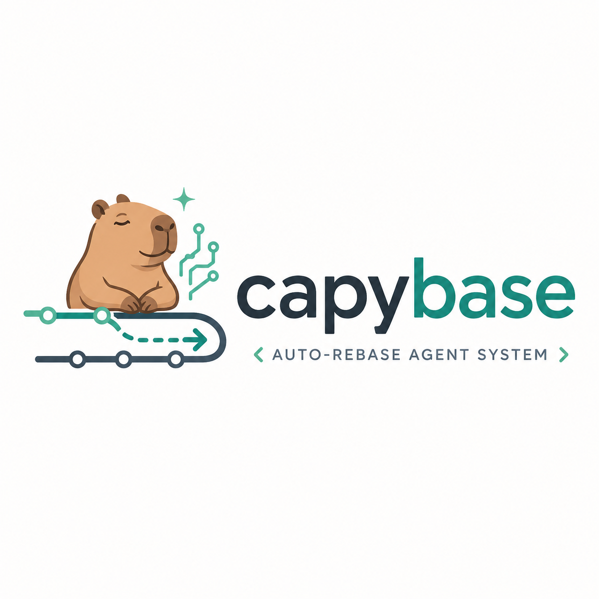

<p align="center"></p>

# capybase

A rebase-conflict resolution agent for local OpenAI-compatible LLM endpoints
(llama-server, LM Studio, etc.). It runs the entire rebase — preflight, backup
branch, resolve → test → continue — and aborts on escalation so your branch
returns to its original HEAD. Supports **Python, Rust, and C/C++** with
language-appropriate compile verification.

Apache-2.0.

## Setup

### 1. Install

```bash
git clone <repo> && cd capybase
python -m venv .venv && . .venv/bin/activate
pip install -e ".[dev]"          # installs capybase + test/embedding deps
```

The diff core (`capybase._cdiff`) is a C extension built automatically during
install. It accelerates the histogram diff and character-level LCS ratio used
by the structural resolver and SBCR fitness. If the build succeeds, the `.so`
lands next to the package; if a C compiler is unavailable, capybase falls back
to a pure-Python implementation (correct, slower on large conflicts). After
pulling changes to `_cdiff.c`, rebuild:

```bash
pip install -e . --force-reinstall --no-build-isolation
```

### 2. Configure the endpoint

Runtime config lives in `capybase.toml` (a template ships in this repo; the
canonical location is `~/.config/capybase/`). Set at minimum:

```toml
[model]
base_url = "http://localhost:8080/v1"
api_key  = "sk-local"
model    = "chat"          # the id /v1/models reports
```

The config schema is versioned (`schema_version = 2`); older files migrate at
load with a notice. Feature activation is one-key-per-feature under
`[features]`; every key's effective value, source layer, and default is
inspectable:

```bash
capybase config explain --all            # every key + loader diagnostics
capybase config explain features.rag     # one key
```

### 3. Calibrate for your model

`max_tokens`, JSON-mode, context window, generation timeout, sample count, and
the prompt-rendering layout all depend on the model behind the endpoint.
Calibrate probes the live model and empirically discovers the best settings:

```bash
capybase calibrate              # probe + multi-fidelity epoch sweep → tuned profile
capybase calibrate --dry-run    # capabilities-only check, no profile written
capybase calibrate --list-tasks # show available task-family corpora
```

**How it works.** A multi-fidelity epoch search over 13 factors spanning
prompt-rendering and mechanism axes (full reference:
`docs/PROMPT_FACTORS.md`):

1. **Capability probe** — JSON success, thinking-chain length,
   instruction-following, and corpus correctness on a spot-check;
   near-perfect models exit early with defaults locked in.
2. **Epoch 1 (screening)** — a 16-run fractional-factorial design ranks
   which factors genuinely drive performance.
3. **Epoch 2 (refinement)** — full factorial on the top-3 factors plus
   survivors, on a larger corpus prefix.
4. **Epoch 3 (tie-breaker)** — the top-2 finalists on the full corpus;
   only when Epoch 2 couldn't separate them.

**Anytime halt.** Ctrl-C after the first completed evaluation returns the
best-so-far configuration and writes the profile — no lost work. Capability
signals drive which factors get screened; `--enable-factor` forces specific
ones. The profile lands in `~/.config/capybase/model_profile.json` (shared
across repos) and applies on every run when the model name matches. For
noise-robust calibration on thinking models, use `--calibrate-reps 3`
(majority vote across replicated evals).

### 4. (Optional) Calibrate embeddings RAG

If your endpoint serves `/v1/embeddings`, `capybase calibrate` detects it and
enables semantic retrieval. `capybase calibrate-embeddings` fits the similarity
floor for your model.

### 5. Provider configs for live runs (canonical endpoint mechanism)

No host, IP, or machine name is tracked in this repository. Live runners
(the `scripts/live_eval*.py` harnesses, `scripts/run-live-test.sh`) resolve
their endpoint exclusively through a **provider config** — a small JSON under
`~/.config/capybase/providers/` (outside any repo) that bundles the host+model
pair for the LLM, optionally a SEPARATE host+model for embeddings, and the
REQUIRED calibration profile:

```json
{
  "profile": "e2b",
  "llm":       { "base_url": "http://your-server:8086/v1", "model": "chat" },
  "embeddings": { "base_url": "http://your-server:8085/v1", "model": "embed" }
}
```

```bash
capybase provider list                    # what's configured
.venv/bin/python scripts/live_eval_realworld.py --provider <name> ...
CB_PROVIDER=<name> ./scripts/run-live-test.sh
```

Precedence per field: CLI flag → `CAPYBASE_*` env var → provider file.
Profiles carry NO host information (one calibration can be reused against a
different host or model), running without a calibration profile is a hard
error, and nothing auto-creates or silently substitutes one. Full reference
— schema, refusal contract, reuse semantics, rerun recipes:
**[docs/PROVIDER_CONFIG.md](docs/PROVIDER_CONFIG.md)**.

**Repo hygiene hook.** `hooks/pre-commit` blocks commits that would introduce
IPv4 literals (non-loopback), `*.local` mDNS hostnames, or machine names into
tracked files. Enable it once per clone:

```bash
git config core.hooksPath hooks
```

## Use

### Safety-first rebase (candidate-ref architecture)

```bash
capybase check                       # git + LLM + tools ready? (no mutation)
capybase rebase --dry-run <target>   # rehearse in a throwaway worktree
capybase rebase <target>             # the WHOLE rebase on a candidate branch
capybase promote [--approve]         # land a RETAINED candidate (CAS onto the source)
capybase publish [--approve]         # publish a RETAINED candidate (lease-protected)
capybase status                      # read-only: latest session + backups
```

`promote` and `publish` act on a retained candidate from a prior
`capybase rebase` — run before one exists, they refuse with "no retained
successful candidate found".

**The default is candidate mode**: `capybase rebase <target>` never mutates
your branch. The entire replay runs in a linked worktree on a visible
candidate branch `capybase/candidate/<branch>@<ts>`, pinned at the pre-run
source OID. On success the candidate branch plus an audit bundle
(`.rebase-agent/candidates/<id>/` — journal, prompts, accept reports, and a
`session_state.json` recording the source/target OIDs and config/profile/
toolchain fingerprints) are retained. On escalation the candidate is deleted
and your branch was never touched — no abort-and-restore dance to get wrong.

- `--in-place` opts back into the legacy mode (the rebase runs on your
  checked-out branch; a backup branch `capybase/backup/<branch>@<ts>` is
  recorded first and escalation aborts back to the original HEAD).
- `--dry-run` stays the throwaway rehearsal (worktree and branch removed).
- `--fresh` forces a re-run even when a fingerprint-matching retained
  candidate exists (by default, an identical request — same OIDs, config,
  profile, toolchain — REUSES the already-tested candidate with zero model
  calls).
- `capybase promote` lands the candidate with
  `git update-ref <source> <candidate> <expected-source-oid>` — an atomic
  compare-and-swap that refuses on any drift (both OIDs named; never
  forces). `--checkout` also refreshes a clean checked-out tree.
- `capybase publish` (service mode) pushes the candidate with the EXPLICIT
  lease `--force-with-lease=<ref>:<expected-remote-oid>` — a remote that
  moved since the run refuses; never the implicit lease. Purely opt-in:
  nothing ever publishes on its own.

**Discarding a rebase (not promoting).** Your branch was never touched, so
there is nothing to roll back — run:

```bash
capybase clean          # --dry-run lists what would go, mutates nothing
```

This removes ALL unpromoted capybase state, leaving no trace: candidate,
dryrun, and backup branches, internal recovery refs, linked worktrees,
and the `.rebase-agent/` directory (audit bundles, sessions, prompts,
snapshots) — then expires unreachable reflog entries and runs
`git gc --prune=now`, so the object store does not keep the deleted
branches' commits and the repository does not grow. Only promoted work
persists, as ordinary commits on your branch — so capybase can be run an
unlimited number of times and a clean in between keeps the repo at its
pre-capybase size.

It is crash- and reboot-safe: worktrees are recognized as capybase's from
any surviving signal (branch name, worktree path, or git's admin entry) —
a crashed run whose teardown never executed, or a reboot that wiped the
temp worktree, is cleaned completely. Git's in-progress markers are
handled without trusting them as truth: a crashed in-place run's rebase
that capybase's records attribute is aborted automatically (you never
started it); an un-attributable in-progress operation is refused by
default, and `--abort-in-progress` is your assertion that the state is
disposable residue (crash before records flushed, or markers inherited
by a copied directory). An ACTIVE run is never touched: a liveness lock
(pid + process start time + the repo path it runs in) detects it — a
copied directory inherits the original's lock, but the lock names the
original path, so the copy cleans while the original runs. Clean touches
only capybase's own namespaces — your branches, reflogs, and history are
never modified. An already-clean repo is a no-op; preview with
`--dry-run`.

An escalated run has already cleaned up after itself (candidate branch and
worktree deleted — nothing to promote, nothing retained). After `promote`,
the candidate branch is deleted too unless `--keep-ref`; the audit bundle
remains as the record of what landed — `capybase clean` removes it when
you no longer want the record.

**Acceptance is a policy, not a feeling.** A check that could not run is
recorded as UNKNOWN, never as a pass (missing toolchains lower trust —
reports say "NOT CHECKED", risk rises, and the acceptance tier degrades).
Each accepted step is graded (tier A deterministic + complete oracles;
B model-assisted or any unknown oracle; C verifier disagreement) and tier
B/C candidates require your explicit `--approve` on promote/publish — the
review act.

When auto-resolution fails and a TTY is present, capybase drops into an
interactive menu (paste a resolution, edit the file, skip, or abort).
`--no-interactive` suppresses this for CI.

### Manual stepping

```bash
capybase inspect   # detect conflicts, write review bundle (no mutation)
capybase manual    # interactive: paste resolutions, validate, stage
capybase run       # full auto: resolve → test → continue
```

Every session writes a journal under `.rebase-agent/sessions/`. On escalation,
`final/review-bundle.md` explains why it stopped and how to resume.

> **`.rebase-agent/` is sensitive** — it stores prompts, conflict snippets,
> candidate resolutions, and file snapshots. It is in `.gitignore`; when
> running against other repos, confirm they ignore it too.

## Resolution layers

A conflict is resolved through a layered pipeline (cheapest/safest first).
Each non-LLM layer declines to the next on any doubt; every accepted result
runs the full validation pipeline before it's applied.

1. **Structural resolver** (default on) — model-free rules for identical sides,
   one-sided changes, disjoint line edits, clean deletions, collection unions
   (list, dict, brace, insertion), C preprocessor directive dedup, token-level
   disjoint edits, entity-disjoint merges, refactoring-aware composition, and
   additive line-union for non-code files (markdown/prose: both sides added
   content — CHANGELOG-class merges resolve deterministically without a
   model call). Zero LLM calls.
2. **Source-derived candidate portfolio** (default on) — before invoking the
   model, five deterministic candidates are assembled from the exact source
   lines (current-only, replayed-only, both orders, shared+distinct) and
   validated through the full pipeline. When one passes, the conflict resolves
   with zero model calls.
3. **Whole-file fast path** (default on) — when one side rewrote the file
   wholesale (churn ratio ≥ 0.90 with dominant churn), its pristine
   merge-index stage file is taken directly. Files with few conflict units,
   and the mid-band variant (0.55–0.90 with ≥ 2.5× dominance), require an
   LLM subsumption adjudication first — the loser may carry features worth
   weaving. A build fail-fast declines swaps the winner can't survive, and
   the wholesale-winner floor guarantees the final resolution never drops
   the dominant rewrite.
4. **Combination search** (default on) — enumerates order-preserving
   interleavings of the two sides for the best combination.
5. **Block-capture** (default on) — for large modify/delete conflicts: makes a
   keep/delete/escalate decision and splices the chosen side verbatim.
6. **LLM resolution** — the model resolves conflicts the pre-LLM layers
   declined, grounded in base + both sides + structural context + RAG few-shot.
   On the standard LLM resolution path, a rejected structural/SBCR draft
   seeds the first model attempt together with its validation failure
   (near-miss seeding, default on; the seed is ephemeral — it drops out
   once the model has its own candidate).
   For oversized files, a lightweight file skeleton (extracted entity names)
   gives the model global awareness the windowed conflict region can't provide.
   An empty first response fast-fails to verified single-side candidates
   instead of burning retries.
7. **Post-candidate obligation repair** (default on) — change-accounting
   derives what each side added that the LLM candidate dropped; a cascade of
   deterministic primitives restores it mechanically (no second model call):
   import-leaf union, deletion application, attribute/meta union, struct-field
   union, keyed-item union, anchor-based block insertion, and TOML manifest
   union. The collection-shaped primitives run one shared engine
   (`keyed_collection.py`) with per-construct codecs; each claims the
   obligations it closes.
8. **CEGIS repair** — failures feed back as counterexamples; the model
   re-resolves with the broken output + the specific failure, bounded by retry
   policy. Failed-patch memory carries summaries of prior attempts so the
   model doesn't repeat the same fix.
9. **Deterministic repair beam** — a growing family of model-free repair
   mechanisms (gcc-diagnostic-driven repair — missing `;`, missing `}`,
   stray characters — side-consistency restore, brace/semicolon
   consensus, the python literal rungs, the era-symbol rename/deletion
   rungs), each firing only on its own diagnostic trigger and
   re-validating before it may land. For C/C++, the compiler's own
   diagnostics drive the repair category.

### Validation

Every accepted resolution passes through:

- **No conflict markers** left in the splice.
- **Exact splice scope** — the merge didn't bleed outside the conflict region.
- **Compile floor** — the fully-spliced file is compile-checked after every
  resolution. Python: `py_compile`. Rust: `cargo check` or `rustc`. C/C++:
  per-unit `gcc`/`g++ -fsyntax-only` plus an optional whole-tree build
  (`make`/`cmake`) when configured — the authoritative oracle that resolves
  sibling headers standalone `gcc` can't. Compiler gates compare errors
  against a pre-conflict baseline (a merge fails only on errors it
  introduces) and abstain when the baseline check cannot run — an
  undecidable delta never fails a merge. Non-code files (markdown,
  lockfiles, prose) are exempt from the structural compile gates; they are
  judged by marker-free-ness and content checks.
- **Syntax / AST preservation** — the merge didn't drop unchanged structure.
- **Both-sides-represented** — a side's additions weren't silently dropped.
- **Verifier-model critic** (default on) — an LLM judge checks the resolution
  preserves both sides' semantic intent. Opt out with
  `features.llm_critic = false`.
- **Silent-resurrection detection** (default on) — after a clean rebase,
  compares the result against content the target branch deliberately deleted
  and flags any that came back.

### Language support

**Python, Rust, and C/C++** are first-class — all get the layered pipeline,
compile-checked verification, and the deterministic repair beam. A
grammar-free abstract parser (no tree-sitter dependency) resolves the
enclosing AST node (`def`/`fn`/`impl`/`struct`) for entity-level merge context
across ~13 languages. For C/C++, a lightweight skeleton extractor
(`adapters/c_skeleton.py`) recovers top-level entity names (includes, macros,
typedefs, structs, function signatures, globals) via a depth-tracking token
scanner — no full parser — and feeds them into oversized-file prompts so the
model has global entity awareness. LSP diagnostics (`rust-analyzer`,
`pyright`) are available as a deeper check via
`validation.enable_lsp_diagnostics`.

C/C++ whole-tree builds are non-uniform (no single `cargo check` equivalent),
so the build command is user-supplied per repo via `[tests] pre_continue`
(e.g. `make -j4`, `cmake --build build`, `./configure && make`). When the
build command can't complete (missing autotools macros, no compiler), the gate
falls back to per-unit `gcc -fsyntax-only` and never falsely rejects a correct
merge on an infrastructure failure.

### Reasoning models

capybase is built for reasoning models (VibeThinker, DeepSeek-R1 style) that
emit long thinking chains. Three knobs matter:

- **`max_tokens`** — large enough for the reasoning chain + the JSON answer.
  Too low → `finish_reason=length` → empty resolution. Calibrate discovers this.
- **`generation_timeout_seconds`** — hard wall-clock cap on one attempt.
- **`request_timeout_seconds`** — per-read socket timeout.

## Status

Python, Rust, and C/C++ are supported end to end. The deterministic layers
(structural rules, source portfolio, SBCR combination search, whole-file
fast path, wholesale-winner floor, refactoring-aware merge, post-candidate
obligation repair, gcc-diagnostic repair) run model-free before or instead
of further LLM calls. The verifier-model critic is default-on. RAG
experience replay self-populates from your accepted resolutions and is on
in actual use, but disabled in eval runs by policy (a seeded store replays
stale resolutions and breaks baseline comparability). Self-consistency is
wired but off by default.

### Results

#### Model and harness

All numbers were produced with **Google Gemma 4 E4B**, served by llama-server
on local hardware. Every case ran once — no majority reruns. **llm** = cases
whose accepted resolution's lineage involved the model — candidate
generation, repair, adjudication ballots, or comment reconciliation. The
complement ran with zero model calls.

#### Current Results (post-s28)

1,501 of the corpus's 1,502 cases ran (the [Corpus](#corpus)
exclusions applied: zenodo-0044's empty oracle, 17 git-resolvable
replays), leaving the **1,484-case real-conflict denominator** for the
tables below. The round spans three process interruptions and 21.1
hours of case wall; zero SETUP_FAILED and zero INFRA_LOST rows. The
fleet ran entirely at defaults — every mechanism on, no toggles.

| lang | cases | PASS | WORKING | era-dead | GATE_UNAVAIL | llm | PASS % | adj % | P+W adj % |
|------|-------|------|---------|----------|--------------|-----|--------|-----------|------------|
| c | 454 | 437 | 5 | 0 | 9 | 83 | 96.3% | 98.2% | 99.3% |
| cpp | 454 | 393 | 14 | 0 | 15 | 77 | 86.6% | 89.5% | 92.7% |
| python | 314 | 295 | 5 | 0 | 0 | 44 | 94.0% | 94.0% | 95.5% |
| rust | 262 | 214 | 4 | 36 | 1 | 12 | 81.7% | 95.1% | 96.9% |
| **total** | **1484** | **1339** | **28** | **36** | **25** | **216** | **90.2%** | **94.1%** | **96.1%** |

Two verdict classes are environmental rather than resolver failures;
both leave the adjusted denominators:

- **era-dead** (36 rows, all rust — tikv 23, polars 12, sea-orm 1):
  both sides and the human oracle fail the current toolchain
  identically — un-passable by construction.
- **GATE_UNAVAILABLE** (25 rows): the oracle fails the same whole-file
  gate the merge faced — duckdb's era-header pre-screen class, php's
  bare arginfo headers, and the fmt-era and redis-class gates.

cpp's lower headline rate is content, not infrastructure: duckdb's
interlocked parser weaves under GCC-15 template-body diagnostics plus
prusaslicer's macro-braced GUI files.

##### Mechanism breakdown

Which mechanisms participate in accepted conflict resolutions, and how
often each one does.

Counting rules:

- A case counts under each mechanism in its accepted candidates'
  lineage.
- Escalated cases have no accepted candidates and are excluded.
- Rows sum to more than the 1,389 accepted cases (1,484 counted minus
  95 escalated): a case with several participating mechanisms counts
  once per mechanism.

| mechanism (participated in accepted) | cases | % of corpus |
|---|---|---|
| deterministic_structural | 674 | 45.4% |
| deterministic_source_current_only | 396 | 26.7% |
| deterministic_source_current_only_stage | 141 | 9.5% |
| plain_llm | 116 | 7.8% |
| combination_search | 101 | 6.8% |
| deterministic_source_replayed_only_stage | 45 | 3.0% |
| intent_coverage | 30 | 2.0% |
| deterministic_generated_file_side | 27 | 1.8% |
| deterministic_wholesale_floor_current | 21 | 1.4% |
| deterministic_empty_side | 15 | 1.0% |
| deterministic_side_consistency_repair | 13 | 0.9% |
| deterministic_wholesale_floor_replayed | 7 | 0.5% |
| deterministic_source_replayed_only | 7 | 0.5% |
| block_capture | 3 | 0.2% |
| deterministic_tree_absent_deletion | 2 | 0.1% |
| deterministic_deletion_respect_prune | 2 | 0.1% |
| deterministic_symbol_injection | 2 | 0.1% |
| deterministic_block_dedup | 1 | 0.1% |
| deterministic_docs_union | 1 | 0.1% |

#### vs Prior round (s28 vs s27)

Both rounds cover the full corpus. The s28 round carries the sprint's
changes: the deterministic repair-rung family (mismatched closer,
triple-quote, rename, expected-token) is promoted, with language
guards keeping the C rungs off python; the era pre-screen and the
draw throttle are always-on; the repair-feedback carriers are
graduated; and the injection/deletion arbitration is new. The shared
cargo cache was also repaired before the run.

| lang | cases | PASS | WORKING | era-dead | GATE_UNAVAIL | PASS % | adj % | P+W adj % | Δ P+W |
|------|-------|------|---------|----------|--------------|--------|-----------|-----------|-------|
| python | 314 | 295 | 5 | 0 | 0 | 94.0% | 94.0% | 95.5% | −1.0pp |
| c | 454 | 437 | 5 | 0 | 9 | 96.3% | 98.2% | 99.3% | +3.3pp |
| cpp | 454 | 393 | 14 | 0 | 15 | 86.6% | 89.5% | 92.7% | +4.0pp |
| rust | 262 | 214 | 4 | 36 | 1 | 81.7% | 95.1% | 96.9% | +0.5pp |
| **total** | **1484** | **1339** | **28** | **36** | **25** | **90.2%** | **94.1%** | **96.1%** | **+2.2pp** |

cpp's +4.0pp is the duckdb weave band converting under the
run-during-interruption resume discipline; python's −1.0pp is repeat
variance on the flask/cython seams (the flip set is chronic and
documented); rust's era floor moved 40 → 36 as two polars rows
converted. No mechanism regressions identified.

#### Verdicts and metrics

**PASS** = marker-free, passes the compile/structural gate, and matches
the human resolution at token similarity ≥ 0.90.
**WORKING** = marker-free, compiles, and preserves both sides' intent,
but diverges from the human resolution below the PASS bar.
**NEAR_MATCH** = valid resolution at token similarity 0.80–0.90.
**ORACLE_DIVERGENT** = valid resolution below 0.80, or a marker or
compile failure without escalation.
**ESCALATE** = the resolver stopped safely and asks for a human:
refusal, budget exhaustion, or a gate it could not repair.
**era-dead** = both sides and the human oracle fail the current
toolchain identically — un-passable by construction, an environmental
rather than resolver failure (verdict ESCALATE_TOOLCHAIN).
**PASS %** = PASS / cases.
**adj %** = PASS / (cases − era-dead − GATE_UNAVAILABLE).
**P+W adj %** = (PASS + WORKING) / (cases − era-dead) — the graded-
success rate.

## Test suites

Three tiers, deliberately separated — a test in the wrong tier is a
bug. Anything needing fetched data is not in pytest; anything making
model calls is not in the corpus suite; anything deterministic is not
in live-eval.

| | pytest (unit) | corpus-tests | live-eval |
|---|---|---|---|
| **What it runs** | unit tests for every mechanism: parsers, verifiers, repair rungs, orchestrator flows (mocked gates) | the human merge M (the oracle) through the real verification floors: `py_compile`, `gcc -fsyntax-only`, `cargo check` in a per-case git worktree | the full orchestrator on real conflicts — actual model calls, full pipeline, majority-of-3 verdicts |
| **Data** | self-contained fixtures; nothing external fetched | real downloaded repos, processed and extracted (fetch script below) | the same real repos |
| **Model calls** | never | never (deterministic) | yes — through the provider config + calibration profile |
| **Entry point** | `pytest tests/ -n 6` | `./corpus/run.sh [python\|rust\|all]` | `scripts/live_eval_realworld.py --provider NAME` |
| **Wall time** | ~45 s (4,636 tests, 6 workers) | minutes (own runner — never pytest) | hours |
| **Purpose** | the per-change regression gate | validates the verifier + the corpus oracle against real-world conflict shapes | the measured product: full runs, README numbers |

After clone and build (`.venv` created per Setup below):

```bash
# 1. unit — always runnable, no prerequisites
.venv/bin/python -m pytest tests/ -q -n 6

# 2. corpus — one-time fetch (~325MB+ archives; licenses require
#    attribution, not redistribution — everything fetched is gitignored)
.venv/bin/python scripts/fetch_mergeconflict_datasets.py --language python --limit 50
./corpus/run.sh python        # or rust, or all

# 3. live-eval — requires a provider + calibration profile (Setup steps
#    3 and 5); a run without one is an error, by design
.venv/bin/python scripts/live_eval_realworld.py --provider my-provider \
    --repeat-nonpass 3 --out /tmp/results.json \
    --preserve-flights /tmp/flights
```

### Corpus

The corpus is **non-git-resolvable conflicts** — cases where git's own
three-way merge leaves markers; anything git resolves cleanly is not a
resolution problem. 1,502 cases are mined from upstream histories,
each carrying both sides, the merge base, and the actual human
resolution as the oracle: Python (cython 150, scikit-learn 56, zenodo
100, flask 10, requests 1; 317), C (php 150, sqlite 133, libuv 101,
redis 55, json-c 17; 456), C/C++ (prusaslicer 150, duckdb 150,
protobuf 73, clickhouse 50, nlohmann-json 38, fmt 6; 467), Rust (tokio
118, tikv 41, axum 38, sea-orm 29, polars 27, clap 5, serde 4; 262).
17 cases resolve cleanly on replay and are excluded at run time; one
empty-oracle case is skipped. Earlier per-language censuses (sprints
17–20) and their methodology notes live in
`docs/eval-results-tracker.md` and the sprint results docs.
